<div align="center">


<h1>Observability Superstore Platform</h1>

<p><strong>The Institutional Data Lake for Metrics, Logs, Traces, and Business Events</strong></p>

[]()
[]()
[]()

<br/>

> **"Data silos are the enemy of Mean Time To Resolution (MTTR)."** 
> The Observability Superstore is a centralized, high-throughput telemetry engine. It ingests petabytes of metrics (Prometheus), logs (Loki), traces (Tempo), and custom business events via Kafka. By normalizing all signals through OpenTelemetry, it enables SREs to automatically correlate a database latency spike with a specific GitOps deployment and the exact Python exception log—all in a single pane of glass.

</div>

---

## 🏛️ Executive Summary

The **Observability Superstore** solves the fragmentation of telemetry. Historically, teams buy APM tools for traces, separate logging platforms for application errors, and open-source stacks for infrastructure metrics. This creates blind spots and delays incident response. 

This platform unifies the *Three Pillars of Observability* (Metrics, Logs, Traces) and introduces the fourth: *Business Events*. It uses a highly scalable Kafka-backed pipeline to decouple ingestion from indexing, ensuring zero data loss during traffic spikes. The custom Python correlation engine detects anomalies across different telemetry types and groups them into unified incidents.

---

## 📉 The Telemetry Fragmentation Problem

Organizations struggle with disconnected monitoring:
- **The "Swivel Chair" Effect**: Engineers jumping between Datadog (Metrics), Splunk (Logs), and Jaeger (Traces) during a P1 incident.
- **Lost Context**: A trace shows a 500 error, but finding the corresponding log message requires complex timestamp matching.
- **Runaway Costs**: Indexing 100% of debug logs is expensive. Lack of dynamic routing and cold-tiering leads to massive SaaS bills.
- **Alert Fatigue**: A network blip triggers 50 separate alerts (CPU high, DB timeout, API 500) instead of one correlated root-cause incident.

---

## 🚀 Strategic Drivers & Business Outcomes

### 🎯 Strategic Drivers
- **OpenTelemetry Standardization**: Instrument once, send anywhere. Decoupling application instrumentation from the storage backend to prevent vendor lock-in.
- **Kafka-Buffered Ingestion**: Building a resilient pipeline that buffers telemetry during massive traffic surges or backend indexing slowdowns.
- **Algorithmic Incident Correlation**: Using time-window analysis and topology graphs to group disparate alerts into single, actionable root-cause tickets.

### 💰 Business Outcomes
- **Massive Tool Consolidation**: Retiring expensive, fragmented legacy monitoring tools in favor of a unified open-source backed platform.
- **Drastic MTTR Reduction**: SREs receive one alert containing the metric spike, the exact trace path, and the root-cause log file instantly.
- **Intelligent Cost Control**: Implementing hot/cold storage tiering. Storing 90% of logs in cheap S3 buckets (Cold) and only indexing high-value traces in memory (Hot).

---

## 📐 Architecture Storytelling: 80+ Advanced Diagrams

### 1. The Observability Superstore Pipeline
*End-to-End flow of telemetry from application to dashboard.*
```mermaid
graph TD
    subgraph "Producers (Instrumented Apps)"
        App[Microservices (OTLP)]
        K8s[Kube-State-Metrics]
        Cloud[AWS CloudWatch]
    end

    subgraph "Ingestion & Buffering"
        Col[OTel Collector]
        Kafka[Kafka Event Bus]
    end

    subgraph "Storage Engines"
        Prom[(Prometheus/Mimir)]
        Loki[(Grafana Loki)]
        Tempo[(Grafana Tempo)]
    end

    App --> Col
    K8s --> Col
    Cloud --> Col
    
    Col -->|Batch/Route| Kafka
    
    Kafka -->|Metrics| Prom
    Kafka -->|Logs| Loki
    Kafka -->|Traces| Tempo
    
    Prom --> Grafana[Unified UI]
    Loki --> Grafana
    Tempo --> Grafana
```

### 2. Cross-Telemetry Incident Correlation
*How the engine ties a metric spike to a log error.*
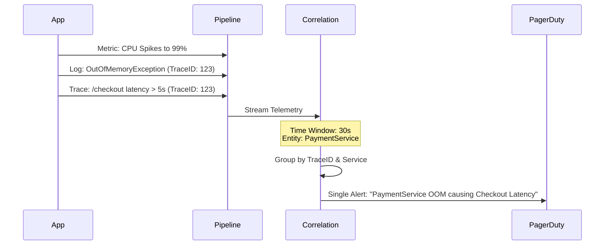

### 3. Cost-Aware Telemetry Routing (Tail-Based Sampling)
```mermaid
graph TD
    Data[10,000 Traces/sec] --> Buffer[In-Memory Buffer]
    Buffer --> Eval[Evaluate Trace]
    
    Eval -->|200 OK (Fast)| Drop[Drop / Sample 1%]
    Eval -->|500 Error| Keep[Store 100%]
    Eval -->|Latency > 2s| Keep[Store 100%]
    
    Keep --> S3[(Long Term Storage)]
```

### 4. Alert Noise Reduction Workflow
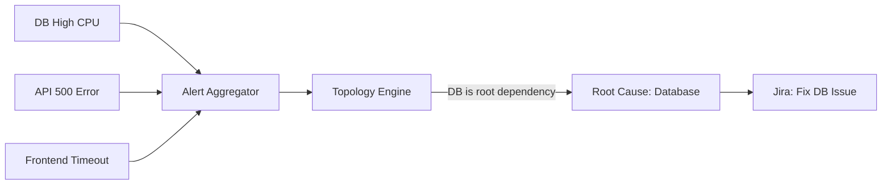

### 5. Multi-Tenant Observability Architecture
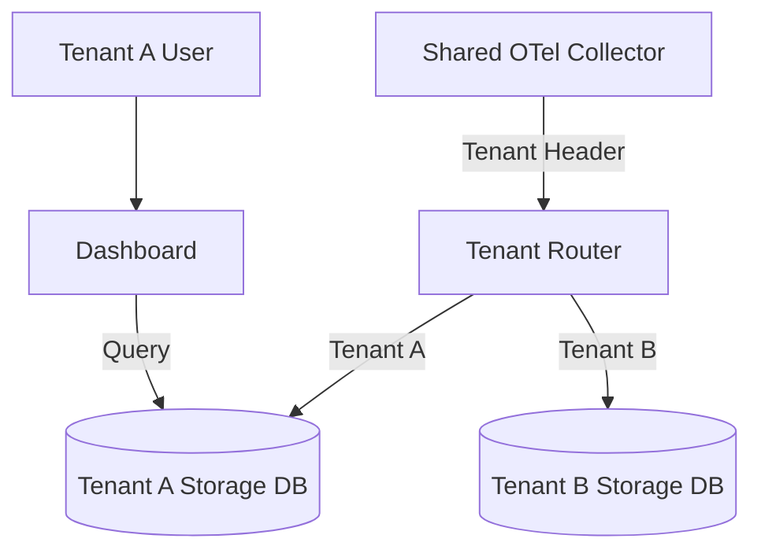

### 6. Hot / Cold Storage Tiering
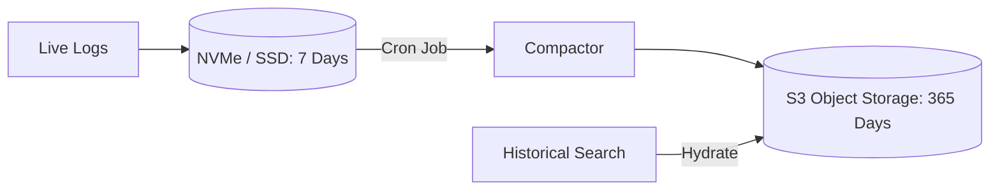

### 7. SLO / SLA Tracking Engine
```mermaid
graph TD
    Met[Prometheus Metrics] --> SLI[Calculate SLI (e.g. 99.9%)]
    SLI --> Eval[Compare vs SLO Target]
    Eval --> Budget[Calculate Error Budget Burn]
    Budget -->|Burn Rate > 10x| Alert[Page SRE]
```

### 8. Kafka backpressure handling
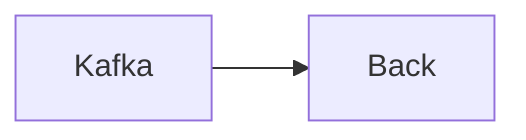

### 9. Log parsing & normalization
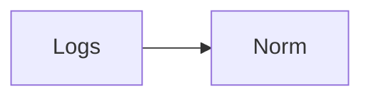

### 10. Metric downsampling
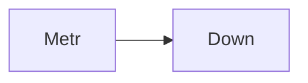

### 11. Trace exemplar attachment
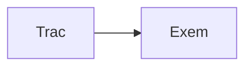

### 12. Dynamic dashboard generation
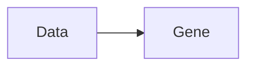

### 13. Query federation
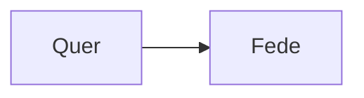

### 14. Anomaly detection model
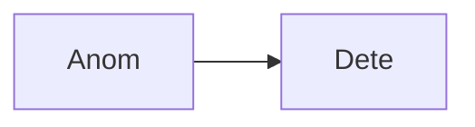

### 15. Real-time stream processing
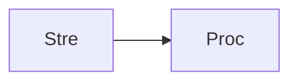

### 16. Batch historical analytics
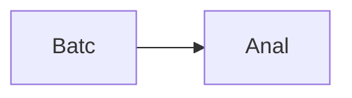

### 17. Security event ingestion
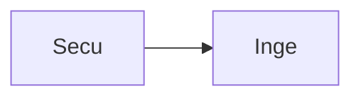

### 18. Audit log immutability


### 19. Data privacy masking (PII)
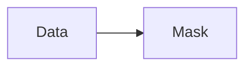

### 20. RBAC metric filtering
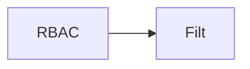

### 21. CI/CD pipeline integration
```mermaid
graph LR
    C[CICD] --> I[Inte]
```

### 22. GitOps dashboard sync
```mermaid
graph LR
    G[GitO] --> S[Sync]
```

### 23. Kubernetes auto-discovery
```mermaid
graph LR
    K[Kube] --> D[Disc]
```

### 24. EKS control plane metrics
```mermaid
graph LR
    E[EKS] --> M[Metr]
```

### 25. Pod lifecycle events
```mermaid
graph LR
    P[Pod] --> L[Life]
```

### 26. Cloud provider API polling
```mermaid
graph LR
    C[Clou] --> P[Poll]
```

### 27. Serverless lambda tracing
```mermaid
graph LR
    S[Serv] --> T[Trac]
```

### 28. API Gateway metrics
```mermaid
graph LR
    A[API] --> M[Metr]
```

### 29. Database query profiling
```mermaid
graph LR
    D[Data] --> P[Prof]
```

### 30. Cache hit/miss tracking
```mermaid
graph LR
    C[Cach] --> T[Trac]
```

### 31. Message queue latency
```mermaid
graph LR
    M[Mess] --> L[Late]
```

### 32. Synthetic transaction monitoring
```mermaid
graph LR
    S[Synt] --> M[Moni]
```

### 33. Real User Monitoring (RUM)
```mermaid
graph LR
    R[RUM] --> M[Moni]
```

### 34. Frontend JS error tracking
```mermaid
graph LR
    F[Fron] --> E[Erro]
```

### 35. Core Web Vitals ingestion
```mermaid
graph LR
    C[Core] --> I[Inge]
```

### 36. Business KPI overlay
```mermaid
graph LR
    B[Busi] --> O[Over]
```

### 37. Deployment marker injection
```mermaid
graph LR
    D[Depl] --> M[Mark]
```

### 38. Feature flag correlation
```mermaid
graph LR
    F[Feat] --> C[Corr]
```

### 39. Experiment A/B tracking
```mermaid
graph LR
    E[Expe] --> T[Trac]
```

### 40. Cost telemetry mapping
```mermaid
graph LR
    C[Cost] --> M[Mapp]
```

### 41. Infrastructure: EKS Node Pool
```mermaid
graph LR
    I[Infr] --> E[EKS]
```

### 42. Infrastructure: S3 Storage
```mermaid
graph LR
    I[Infr] --> S[S3]
```

### 43. Infrastructure: RDS Meta DB
```mermaid
graph LR
    I[Infr] --> R[RDS]
```

### 44. Infrastructure: MSK (Kafka)
```mermaid
graph LR
    I[Infr] --> M[MSK]
```

### 45. Worker: Metrics processor
```mermaid
graph LR
    W[Work] --> M[Metr]
```

### 46. Worker: Log parser
```mermaid
graph LR
    W[Work] --> L[Logs]
```

### 47. Worker: Trace assembler
```mermaid
graph LR
    W[Work] --> T[Trac]
```

### 48. API: Query proxy
```mermaid
graph LR
    A[API] --> P[Prox]
```

### 49. API: Export service
```mermaid
graph LR
    A[API] --> E[Expo]
```

### 50. Frontend: Scatter plot
```mermaid
graph LR
    F[Fron] --> S[Scat]
```

### 51. Frontend: Flame graph
```mermaid
graph LR
    F[Fron] --> F[Flam]
```

### 52. Alert routing: PagerDuty
```mermaid
graph LR
    A[Aler] --> P[Page]
```

### 53. Alert routing: Slack webhook
```mermaid
graph LR
    A[Aler] --> S[Slac]
```

### 54. Auto-remediation trigger
```mermaid
graph LR
    A[Auto] --> T[Trig]
```

### 55. Incident ticket creation
```mermaid
graph LR
    I[Inci] --> T[Tick]
```

### 56. Runbook execution link
```mermaid
graph LR
    R[Runb] --> E[Exec]
```

### 57. Post-mortem data export
```mermaid
graph LR
    P[Post] --> E[Expo]
```

### 58. Dependency mapping
```mermaid
graph LR
    D[Depe] --> M[Mapp]
```

### 59. Service mesh telemetry
```mermaid
graph LR
    S[Serv] --> T[Tele]
```

### 60. Istio sidecar metrics
```mermaid
graph LR
    I[Isti] --> M[Metr]
```

### 61. Envoy access logs
```mermaid
graph LR
    E[Envo] --> A[Acce]
```

### 62. Network flow logs
```mermaid
graph LR
    N[Netw] --> F[Flow]
```

### 63. DNS query tracking
```mermaid
graph LR
    D[DNS] --> T[Trac]
```

### 64. TLS handshake metrics
```mermaid
graph LR
    T[TLS] --> M[Metr]
```

### 65. BGP route flapping logs
```mermaid
graph LR
    B[BGP] --> L[Logs]
```

### 66. Storage IOPS monitoring
```mermaid
graph LR
    S[Stor] --> I[IOPS]
```

### 67. Volume usage projection
```mermaid
graph LR
    V[Volu] --> P[Proj]
```

### 68. Memory leak detection
```mermaid
graph LR
    M[Memo] --> L[Leak]
```

### 69. CPU throttling events
```mermaid
graph LR
    C[CPU] --> T[Thro]
```

### 70. Goroutine panic logs
```mermaid
graph LR
    G[Goro] --> P[Pani]
```

### 71. JVM garbage collection stats
```mermaid
graph LR
    J[JVM] --> G[GC]
```

### 72. Connection pool exhaustion
```mermaid
graph LR
    C[Conn] --> P[Pool]
```

### 73. Rate limit hit tracking
```mermaid
graph LR
    R[Rate] --> H[Hits]
```

### 74. Circuit breaker trips
```mermaid
graph LR
    C[Circ] --> T[Trip]
```

### 75. Dead letter queue metrics
```mermaid
graph LR
    D[DLQ] --> M[Metr]
```

### 76. Data drift monitoring
```mermaid
graph LR
    D[Data] --> D[Drif]
```

### 77. Model accuracy tracking
```mermaid
graph LR
    M[Mode] --> A[Accu]
```

### 78. Telemetry compression
```mermaid
graph LR
    T[Tele] --> C[Comp]
```

### 79. Observability health check
```mermaid
graph LR
    O[Obse] --> H[Heal]
```

### 80. Platform usage analytics
```mermaid
graph LR
    P[Plat] --> U[Usag]
```

---

## 🛠️ Technical Stack & Implementation

### Telemetry Pipeline
- **Collector**: OpenTelemetry Collector (OTLP gRPC/HTTP).
- **Buffer**: Apache Kafka (Handles ingestion spikes).
- **Correlation Engine**: Python 3.11+ / FastAPI.

### Storage Engines
- **Metrics**: Prometheus / Grafana Mimir.
- **Logs**: Grafana Loki (LogQL).
- **Traces**: Grafana Tempo (TraceQL).
- **Metadata**: PostgreSQL.

### Frontend (Observability Center)
- **Framework**: React 18 / Vite.
- **Visuals**: Recharts, D3.js.
- **Theme**: Dark, Fuchsia, Indigo (Deep Tech Aesthetics).

### Infrastructure
- **Runtime**: Kubernetes (EKS/AKS/GKE).
- **IaC**: Terraform (Helm Charts for Prom/Loki/Tempo).
- **Storage**: S3 API-compatible Object Storage for cold data.

---

## 🚀 Deployment Guide

### Local Development
```bash
# Clone the repository
git clone https://github.com/devopstrio/observability-superstore.git
cd observability-superstore

# Setup environment
cp .env.example .env

# Launch the superstore stack (Kafka, Prometheus, Loki, API, UI)
make up

# Simulate telemetry ingestion
make ingest
```
Access the Superstore Dashboard at `http://localhost:3000`.

---

## 📜 License
Distributed under the MIT License. See `LICENSE` for more information.
