<div align="center">


<h1>Observability Superstore Platform</h1>

<p><strong>The Institutional Data Lake for Metrics, Logs, Traces, and Business Events.</strong></p>

[]()
[]()
[]()

<br/>

> **"Data silos are the enemy of Mean Time To Resolution (MTTR)."** 
> **Observability Superstore** is an enterprise-grade platform designed to provide a secure, measurable, and highly automated foundation for global telemetry management. It orchestrates the complex lifecycle of observability data—from high-throughput ingestion and real-time processing to multi-dimensional correlation and unified SRE-driven governance.

</div>

---

## 🏛️ Executive Summary

Fragmented telemetry tools and disconnected data silos are strategic operational liabilities; lack of a unified observability plane is a primary barrier to organizational agility. Organizations fail to achieve high availability not because of a lack of metrics, but because of fragmented monitoring standards, lack of automated correlation, and an inability to visualize the entire service topology with operational precision.

This platform provides the **Telemetry Intelligence Plane**. It implements a complete **Enterprise Observability-as-Code Framework**, enabling SRE and Platform teams to manage system visibility as a first-class citizen. By automating the ingestion of logs, metrics, and traces through a unified OpenTelemetry pipeline and orchestrating real-time correlation engines, we ensure that every organizational asset—from edge load balancers to backend database clusters—is observable by default, audited for history, and strictly aligned with institutional reliability SLAs.

---

## 📐 Architecture Storytelling: Principal Reference Models

### 1. Principal Architecture: Global Observability Superstore & Telemetry Intelligence Plane
This diagram illustrates the end-to-end flow from multi-cloud telemetry ingestion and OTel-driven processing to unified correlation, visualization, and institutional observability auditing.

```mermaid
graph LR
    %% Subgraph Definitions
    subgraph TelemetryIngress["Telemetry & Event Ingress"]
        direction TB
        App["Microservices (OTLP)"]
        Infr["Infra Metrics (Prometheus)"]
        Events["Business Events (Kafka)"]
    end

    subgraph IntelligenceEngine["Telemetry Intelligence Hub"]
        direction TB
        API["FastAPI Observability Gateway"]
        Correlator["Signal Correlation Engine"]
        Enricher["Context & Metadata Enricher"]
        Dispatcher["Alert & Event Dispatcher"]
    end

    subgraph StoragePlane["Multi-Dimensional Storage"]
        direction TB
        TSDB["Metric Store (Mimir)"]
        LogStore["Log Store (Loki)"]
        TraceStore["Trace Store (Tempo)"]
    end

    subgraph OperationsHub["Institutional Observability Hub"]
        direction TB
        Scorecard["Monitoring Maturity Score"]
        Analytics["Performance & SLA Stats"]
        Audit["Forensic Telemetry Metadata Lake"]
    end

    subgraph DevOps["Observability-as-Code Orchestration"]
        direction TB
        TF["Terraform Telemetry Modules"]
        Grafana["Unified Dashboards"]
        AlertManager["Intelligent Alerting"]
    end

    %% Flow Arrows
    TelemetryIngress -->|1. Ingest OTLP| API
    API -->|2. Enrich Context| Enricher
    Enricher -->|3. Correlate Signals| Correlator
    Correlator -->|4. Store Data| StoragePlane
    
    StoragePlane -->|5. Visualize| Grafana
    Correlator -->|6. Trigger Alert| AlertManager
    AlertManager -->|7. Notify Team| OperationsHub
    
    API -->|8. Visualize Health| Scorecard
    Scorecard -->|9. Track Burn Rate| Analytics
    Scorecard -->|10. Record Result| Audit
    
    TF -->|11. Provision Hub| IntelligenceEngine
    Grafana -->|12. Query Data| StoragePlane
    Audit -->|13. Improve Baselines| Correlator

    %% Styling
    classDef ingress fill:#f5f5f5,stroke:#616161,stroke-width:2px;
    classDef intel fill:#fce4ec,stroke:#880e4f,stroke-width:2px;
    classDef storage fill:#e1f5fe,stroke:#01579b,stroke-width:2px;
    classDef ops fill:#e0f2f1,stroke:#004d40,stroke-width:2px;
    classDef devops fill:#fffde7,stroke:#f57f17,stroke-width:2px;

    class TelemetryIngress ingress;
    class IntelligenceEngine intel;
    class StoragePlane storage;
    class OperationsHub ops;
    class DevOps devops;
```

### 2. The Observability Data Lifecycle Flow
The continuous path of telemetry data from initial ingestion and processing to active enrichment, storage, visualization, and forensic auditing.

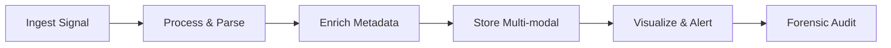

### 3. Multi-Cloud Telemetry Mesh
Strategic centralization of telemetry ingestion in a "Hub" environment, with OTel collectors in "Spoke" regions (AWS, Azure, GCP) providing isolated signal gathering.

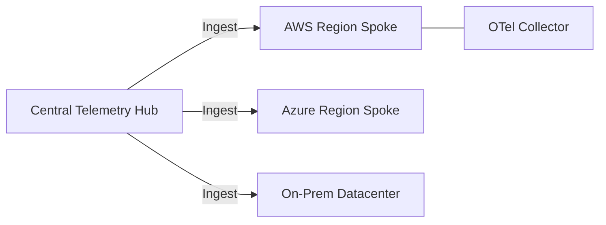

### 4. OpenTelemetry (OTel) Pipeline Orchestration
Using a standardized OTel pipeline to route logs, metrics, and traces through a unified processing layer, ensuring consistency and preventing vendor lock-in.

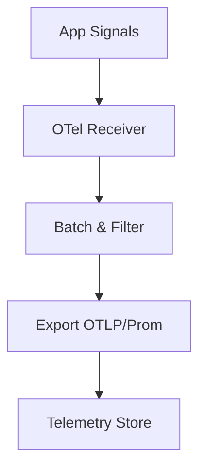

### 5. Distributed Tracing & Service Map Flow
Visualizing complex microservice interactions, identifying performance bottlenecks, and tracking p99 latency across the entire global service graph.

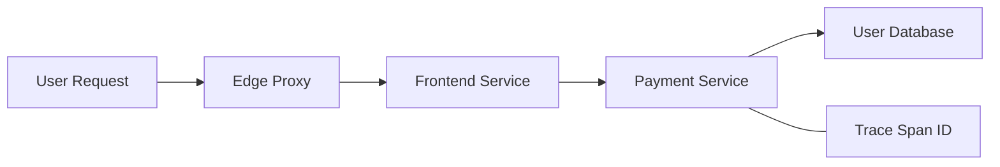

### 6. Log Analytics & Enrichment Pipeline
Real-time parsing, masking of PII data, and enrichment of raw logs with deployment metadata and infrastructure context to accelerate root-cause analysis.

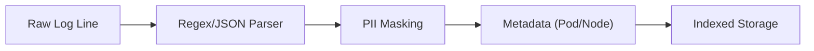

### 7. Institutional Observability Scorecard
Grading organizational performance based on key indicators: Monitoring Coverage, SLO/SLA Compliance, and Mean Time to Resolution (MTTR).

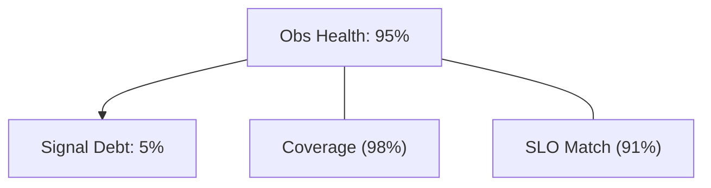

### 8. Identity & RBAC for Monitoring Governance
Managing fine-grained access to telemetry dashboards, alert policies, and raw data between Observability Architects, SREs, and Dashboard Consumers.

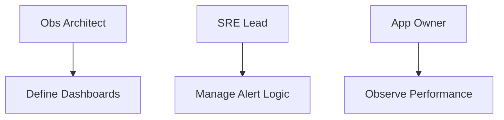

### 9. IaC Deployment: Observability-as-Code Framework
Using modular Terraform to deploy and manage the versioned distribution of the telemetry hubs, OTel collectors, and forensic metadata lakes.

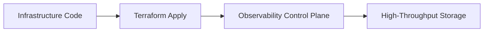

### 10. AIOps Anomaly Detection & Baseline Flow
Using real-time machine learning to identify deviations from historical performance baselines and predict potential service failures before they impact users.

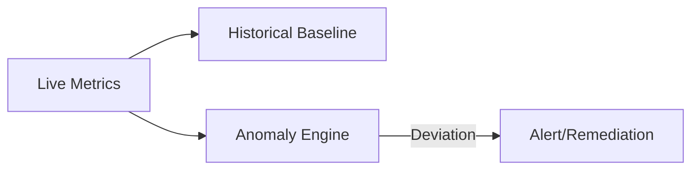

### 11. Metadata Lake for Forensic Telemetry Audit
Storing long-term records of every metric spike, log event, and trace span for institutional record-keeping, compliance auditing, and post-incident investigation.

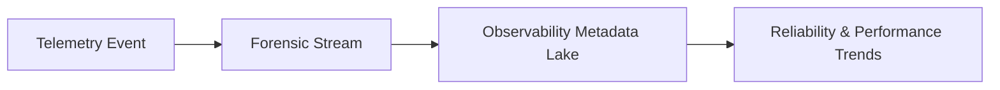

---

## 🏛️ Core Observability Pillars

1.  **Unified OTLP Ingestion**: Standardizing all telemetry ingestion through the OpenTelemetry protocol.
2.  **Cross-Signal Correlation**: Automating the linkage between logs, metrics, and traces for rapid root-cause analysis.
3.  **Scalable Data Processing**: Orchestrating high-throughput Kafka-backed pipelines for resilient data delivery.
4.  **Privacy-Aware Logging**: Implementing real-time masking of sensitive data within the telemetry stream.
5.  **Multi-Dimensional Visualization**: Providing a single pane of glass for infrastructure and application health.
6.  **Full Telemetry Auditability**: Immutable recording of every system event and alert for institutional forensics.

---

## 🛠️ Technical Stack & Implementation

### Telemetry Engine & APIs
*   **Framework**: Python 3.11+ / FastAPI.
*   **Pipeline Core**: OpenTelemetry Collector with Kafka for high-durability buffering.
*   **Correlation Hub**: Custom engine for linking disparate telemetry signals via TraceID and metadata.
*   **Persistence**: PostgreSQL (Metadata Lake) and Redis (Live Alert Cache).
*   **Auth Orchestrator**: Federated OIDC/SAML for least-privilege observability access.

### Observability Dashboard (UI)
*   **Framework**: React 18 / Vite.
*   **Theme**: Dark, Fuchsia, Indigo (Deep technical operational aesthetic).
*   **Visualization**: Recharts, D3.js, and Grafana for unified telemetry visualization.

### Infrastructure & DevOps
*   **Runtime**: AWS EKS or Azure Kubernetes Service (AKS).
*   **Storage Plane**: Grafana Mimir (Metrics), Loki (Logs), and Tempo (Traces).
*   **IaC**: Modular Terraform for deploying the observability hub and collector distributions.

---

## 🏗️ IaC Mapping (Module Structure)

| Module | Purpose | Real Services |
| :--- | :--- | :--- |
| **`infrastructure/obs_hub`** | Central management plane | EKS, PostgreSQL, Redis |
| **`infrastructure/ingestion`** | OTel & Kafka pipeline | Collector, MSK, Event Hub |
| **`infrastructure/storage`** | Long-term telemetry sinks | Mimir, Loki, Tempo, S3 |
| **`infrastructure/auditing`** | Forensic metadata sinks | S3, Athena, Quicksight |

---

## 🚀 Deployment Guide

### Local Principal Environment
```bash
# Clone the observability platform
git clone https://github.com/devopstrio/observability-superstore.git
cd observability-superstore

# Configure environment
cp .env.example .env

# Launch the Superstore stack
make init

# Trigger a mock telemetry ingestion and signal correlation simulation
make simulate-ingestion
```

Access the Observability Dashboard at `http://localhost:3000`.

---

## 📜 License
Distributed under the MIT License. See `LICENSE` for more information.

---
<div align="center">
  <p>© 2026 Devopstrio. All rights reserved.</p>
</div>
